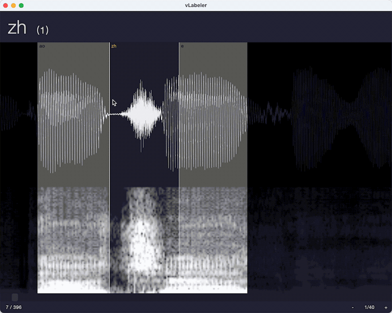

# vLabeler

[](https://discord.gg/yrTqG2SrRd)

`vLabeler` is an open-sourced voice labeling application, aiming:
- Modern and fluent UI/UX
- Customizable labeling/import/export, to be used by different types of voice editor apps
- High performance with multiplatforms

**The project is now in Alpha stage.
For helps, suggestions, issue reports etc. please join our [Discord](https://discord.gg/yrTqG2SrRd).** 

## Download
See [Releases](https://github.com/sdercolin/vlabeler/releases).

The following platforms are provided in the releases.
- Windows (.exe)
- Mac (Apple Silicon) (.dmg)
- Mac (Intel) (.dmg)
- Ubuntu (.deb)

For other linux os you may have to build it by yourself.

### For macOS users
If you cannot open the app with a "damaged" error, please run `sudo xattr -rc /Applications/vLabeler.app`
with your terminal. (sudo command requires your password)

## Building
vLabeler is built by [Compose Multiplatform](https://github.com/JetBrains/compose-jb). You can use Gradle to build the application. [See more](https://github.com/JetBrains/compose-jb/tree/master/tutorials/Native_distributions_and_local_execution)

Currently cross-platform building is not supported. Only packages for your OS are built.

Please ensure you have **JDK 15+** for building.

```
// Package by installer
./gradlew package

// Or, build executable app
./gradlew createDistributable
```

## Usage
Many behaviors of vLabeler depend on customizable `labeler`s.
Currenty built-in labelers include `UTAU oto labeler` and `Sinsy (NNSVS/ENUNU) lab labeler`.

- oto labeler (Basic mode, SetParam style)
  

- lab labeler (Continuous mode)
  

## Get started
1. Click `Create project` 
2. Select a folder containing your sample files
3. If you don't want to save vLabeler files (project file, processed wav files etc.) in the sample folder, change the `Working directory`
4. Change `Project name` if you would like
5. Select a labeler (e.g. UTAU oto labeler if you are editign UTAU oto)
6. Select a label file template and its encoding (e.g. the existing oto file), or leave it blank to use the default template (not recommended)
7. Click `OK` and start editing
8. Click `Export` in the menu to get the edited label file
 
## Available keyboard/mouse actions
Note that following `Ctrl` means `Command` if you are using macOS.

### Move parameter lines
- Mouse drag on normal parameters: move itself
- Mouse drag on primary parameters: move all the lines together
- `Shift`: revert the primary settings

### Audio playback
- `Space`: play from the beginning / Stop
- `Ctrl` + mouse click: play the clicked section

### Scrolling
- `Shift` + mouse wheel scroll: horizontal scroll
- `F` or Focus button in the center of bottom bar: Scroll to center the current entry in the screen

### Zoom in/out
- `=` or numpad `+` or `+` button in the bottom bar: zoom in
- `-` or numpad `-` or `-` button in the bottom bar: zoom out
- Resolution button in the bottom bar: open dialog for resolution input

### Switch entry/sample
- Mouse wheel scroll: go to previous/next entry
- `Up`/`Down`: go to previous/next entry
- `<`/`>` buttons in the bottom bar: go to previous/next entry
- `Ctrl` + mouse wheel scroll: go to previous/next sample
- `Ctrl` + `Up`/`Down`: go to previous/next sample
- `<<`/`>>` buttons in the bottom: go to previous/next sample
- `Ctrl` + `G` or entry number button in the bottom bar: show `Go to entry...` dialog

## Configure
After the first run, you can find `app.conf.json` and `labelers/*.labeler.json` under `.../<user>/vLabeler` directory. (For macOS it's `~/Library/vLabeler`)
Check [LabelerConf.kt](https://github.com/sdercolin/vlabeler/blob/main/src/jvmMain/kotlin/com/sdercolin/vlabeler/model/LabelerConf.kt) and [AppConf.kt](https://github.com/sdercolin/vlabeler/blob/main/src/jvmMain/kotlin/com/sdercolin/vlabeler/model/AppConf.kt) 
and make sure you understand the content before you edit them.

You can reset configurations by removing the files.

Built-in configuration UI is not available yet. (Please wait!)

## Logs
Logs are written to files under `.../vLabeler/.logs` where `vLabeler` is the app's external directory described in the `Configure` section.
You can check the logs for development/debug/test purposes.
When reporting issues, please attach the recent log files.

## Known issues
1. Audio files with a higher bit depth than 16-bit cannot be played normally. Please convert them priorly.
2. When the audio file gets very long, the editor may get errors while painting. Please zoom out the editor or split the files. You may find [this tool](https://github.com/sdercolin/LongWavOtoHelper) helpful on Windows.
3. On Linux, file chooser may not be able to select an empty folder. Please creating something inside, or copy + paste its path.
